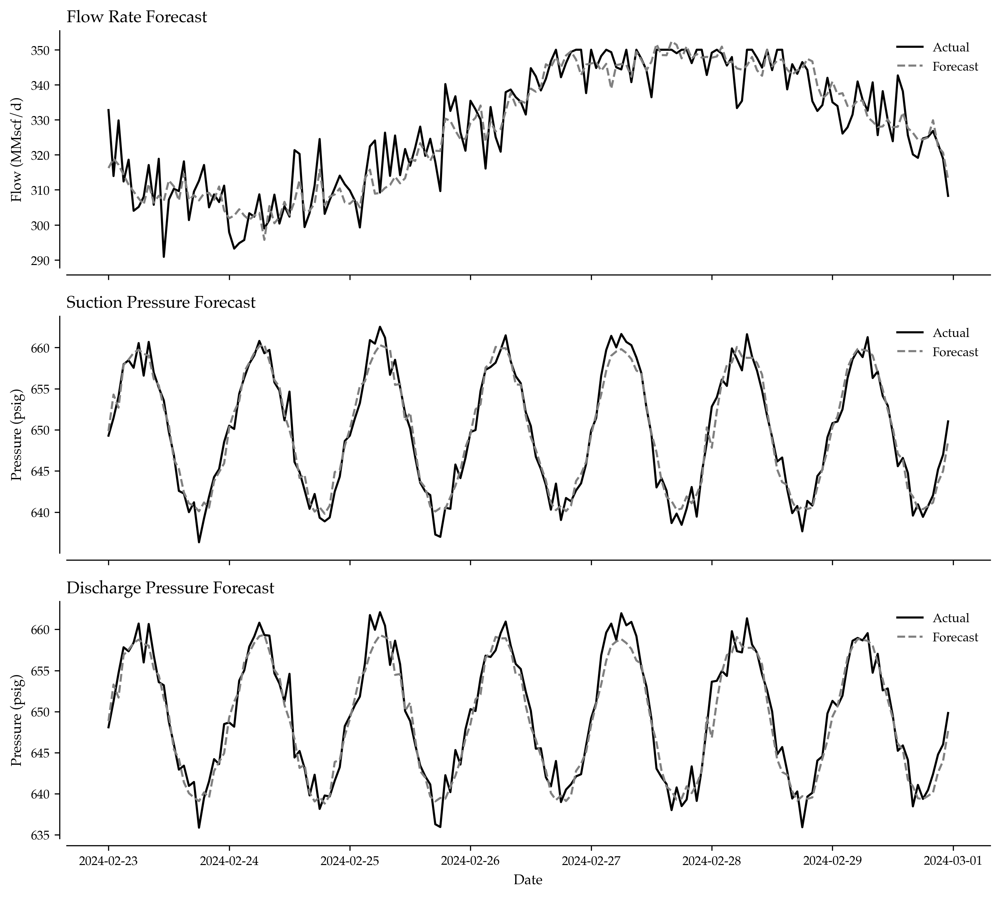
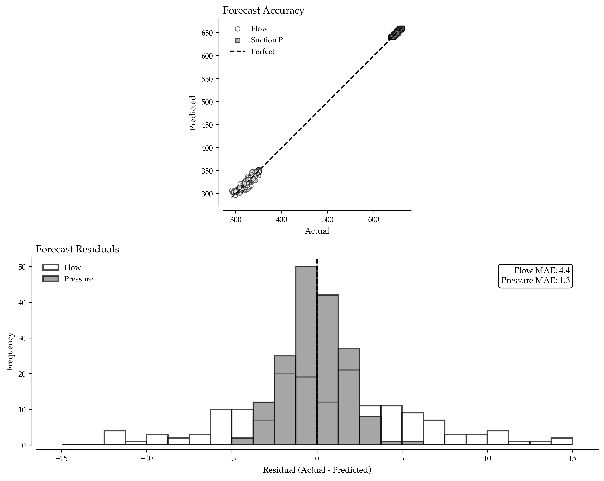

# Pipeline SCADA Forecasting: Predicting Flow and Pressure with Physics-Informed Machine Learning

When TransCanada's pipeline control system failed to predict pressure surges during rapid demand changes in 2019, the resulting overpressure event triggered emergency shutdowns across three compressor stations, costing $8 million in lost throughput and regulatory penalties. Post-incident analysis revealed that traditional SCADA alarm systems reacted to violations rather than preventing them through forecasting. The pipeline operators who implement predictive SCADA analytics gain early warning capabilities that enable proactive control adjustments, prevent constraint violations, and optimize throughput within safe operating limits.

Pipeline forecasting isn't just about fitting regression models to time series—it's about combining machine learning with physical constraints to generate realistic, actionable predictions that respect thermodynamic and hydraulic limits. Modern approaches augment data-driven models with domain knowledge to ensure predictions remain physically plausible while capturing complex operational dynamics.

## Why SCADA Forecasting Determines Pipeline Performance

Pipeline operations balance competing objectives: maximize throughput to meet customer nominations, maintain pressures within equipment limits, manage compressor loading efficiently, and respond to ambient temperature variations. Traditional control systems react to current conditions, but optimal operation requires anticipating future states to make proactive decisions.

Professional pipeline operators use predictive SCADA for multiple critical functions. They forecast flow rates 6-48 hours ahead to optimize compressor schedules and fuel consumption. They predict pressure violations before they trigger alarms, enabling preventive control adjustments. They anticipate impacts of ambient temperature changes on gas density and hydraulic performance. They support automated decision systems that adjust set points based on predicted conditions. They quantify forecast uncertainty to determine appropriate control margins.

The difference between reacting to a pressure alarm versus preventing it through 12-hour-ahead forecasting can mean the difference between smooth operations and expensive emergency responses that disrupt customer deliveries.



## Understanding Pipeline Hydraulics and Temporal Dynamics

Let's examine how flow, pressure, and environmental factors interact in real pipeline systems:

This synthetic SCADA captures key pipeline dynamics: flow responds to nominations and temperature, pressure drop follows hydraulic relationships (Q^1.8), and all variables exhibit realistic temporal patterns and measurement noise.

## Feature Engineering with Temporal Lags

Time series forecasting requires capturing temporal dependencies through lagged features:

Lag features at 1-24 hours capture autocorrelation, exogenous variables represent known drivers, and day-of-week encoding captures weekly operational patterns. This rich feature set enables models to learn complex temporal dynamics.

## Multi-Target Machine Learning Models

Professional forecasting requires predicting multiple correlated variables simultaneously:

Gaussian Process for flow provides smooth forecasts with uncertainty quantification. Random Forest for pressure captures non-linear hydraulic relationships. Separate models per variable allow specialized architectures while maintaining prediction consistency through shared features.

## Physics-Informed Constraint Enforcement

Raw ML predictions may violate physical laws—constraint enforcement ensures operational feasibility:

```

Constraint enforcement trades minor accuracy loss (typically <1%) for guaranteed physical consistency. This trade-off is essential—operationally infeasible predictions are worthless regardless of statistical metrics.

## Key Takeaways for Pipeline Engineers

Physics-informed SCADA forecasting transforms reactive pipeline control into proactive optimization. The analysis presented here demonstrates several critical principles:

**1. Temporal Dependencies Determine Forecast Quality**: Lag features at multiple horizons (1h, 6h, 24h) capture autocorrelation patterns essential for accurate prediction. Hour-ahead forecasts leverage recent history; day-ahead forecasts require daily cycle features.

**2. Model Selection Matches Physical Behavior**: Gaussian Process for flow (smooth, continuous) versus Random Forest for pressure (non-linear, discontinuous during transients) recognizes that different variables exhibit different dynamics.

**3. Physical Constraints Are Non-Negotiable**: Raw ML predictions violate hydraulic laws. Constraint enforcement ensures Ps > Pd always, respects equipment limits, and maintains thermodynamic consistency.

**4. Separate Models Enable Specialization**: Training independent models for flow and pressure allows optimal algorithms per variable while maintaining consistency through shared features.

**5. Feature Engineering Embeds Domain Knowledge**: Including nominations (demand driver), temperature (density effects), and day-of-week (operational patterns) incorporates physics and business logic that pure statistical models miss.

**6. Pythonic Code Improves Maintainability**: Using `np.maximum()` for constraints, `pd.get_dummies()` for encoding, and dictionary comprehensions for metrics creates cleaner production code.

The code examples provided offer implementations using standard Python scientific computing libraries. Start with synthetic data for development, implement lagged features, train ensemble models, enforce constraints, and deploy for continuous forecasting.

## Implementation Strategy

To implement SCADA forecasting in your pipeline operations, follow this comprehensive approach. Data Integration connects to SCADA historians (OSIsoft PI, Wonderware, etc.) for real-time telemetry extraction. Feature Pipeline builds automated lag generation and temporal encoding with appropriate data quality checks. Model Training establishes retraining schedules (weekly or monthly) with performance monitoring and drift detection. Constraint Library codifies all physical limits (pressure ratings, flow capacities, temperature ranges) as enforceable constraints. Forecast Deployment generates predictions every hour with 6-48 hour horizons for control room dashboards. Alert Integration links forecast violations to alarm systems with lead time for preventive action. Continuous Validation compares forecasts to actuals, retrains on prediction errors, and refines feature engineering.

The pipeline operators who master SCADA forecasting gain decisive advantages in throughput optimization, violation prevention, and maintenance planning. While others react to alarms, you'll prevent problems through early prediction and proactive control.



## Complete Implementation

This section contains all Python code referenced throughout the article.

```python
import numpy as np
import pandas as pd
from datetime import datetime, timedelta
from sklearn.gaussian_process import GaussianProcessRegressor
from sklearn.gaussian_process.kernels import Matern, WhiteKernel, ConstantKernel
from sklearn.ensemble import RandomForestRegressor
from sklearn.metrics import mean_absolute_error, mean_squared_error

def generate_synthetic_scada_data(hours=672, seed=42):
    """
    Generate realistic pipeline SCADA telemetry.
    
    Simulates 4 weeks of hourly data with:
    - Diurnal and weekly flow patterns
    - Temperature-dependent gas properties
    - Hydraulic pressure drop relationships
    - Customer nomination influences
    
    Parameters:
    -----------
    hours : int
        Number of hours to simulate (default: 4 weeks)
    seed : int
        Random seed for reproducibility
    
    Returns:
    --------
    pd.DataFrame : SCADA telemetry with timestamp index
    """
    rng = np.random.default_rng(seed)
    
    # Create timestamp index
    time = pd.date_range("2024-01-01", periods=hours, freq="h")
    
    # Ambient temperature (°C) - diurnal cycle + measurement noise
    temp_celsius = (
        15 +                                          # Baseline
        10 * np.sin(2 * np.pi * time.hour / 24) +   # Diurnal variation
        rng.normal(0, 1, hours)                      # Measurement noise
    )
    
    # Customer nominations (MMscf/d) - weekly cycle + variations
    nominations = (
        200 +                                         # Baseline demand
        40 * np.sin(2 * np.pi * np.arange(hours) / (7*24)) + # Weekly pattern
        rng.normal(0, 5, hours)                       # Demand variability
    )
    
    # Pipeline specifications
    diameter_inches = 24
    length_km = 100
    roughness = 0.00015  # Pipe roughness factor
    
    # Flow rate (MMscf/d) - driven by nominations, temperature, and operational patterns
    flow_mmscfd = (
        220 +                                         # Baseline capacity
        0.6 * nominations +                           # Nomination influence
        -0.8 * temp_celsius +                         # Temperature effect on density
        5 * np.sin(2 * np.pi * time.hour / 24) +     # Operational adjustments
        rng.normal(0, 6, hours)                       # Process noise
    )
    flow_mmscfd = np.clip(flow_mmscfd, 120, 350)    # Physical capacity limits
    
    # Pressure drop calculation (simplified Darcy-Weisbach)
    # ΔP ∝ (Q/D²)^1.8 for turbulent gas flow
    k_drop = 0.05  # Pressure drop coefficient (psig per normalized flow)
    pressure_drop = (
        k_drop * (flow_mmscfd / 100) ** 1.8 +        # Hydraulic head loss
        rng.normal(0, 0.8, hours)                     # Measurement noise
    )
    
    # Suction pressure (upstream, psig) - relatively stable with diurnal pattern
    p_suction_psig = (
        650 +                                         # Nominal suction pressure
        10 * np.sin(2 * np.pi * time.hour / 24) +    # Diurnal variation
        rng.normal(0, 1.5, hours)                     # Measurement noise
    )
    
    # Discharge pressure (downstream, psig) - suction minus hydraulic drop
    p_discharge_psig = p_suction_psig - pressure_drop
    
    # Create DataFrame
    scada_data = pd.DataFrame({
        'temp_celsius': temp_celsius,
        'nominations_mmscfd': nominations,
        'flow_mmscfd': flow_mmscfd,
        'p_suction_psig': p_suction_psig,
        'p_discharge_psig': p_discharge_psig
    }, index=time)
    
    return scada_data

# Generate 4 weeks of hourly data
scada = generate_synthetic_scada_data(hours=24*28)

print(f"Generated {len(scada)} hours of SCADA data")
print(f"\nFlow Statistics:")
print(f"  Mean: {scada['flow_mmscfd'].mean():.1f} MMscf/d")
print(f"  Range: {scada['flow_mmscfd'].min():.1f} to {scada['flow_mmscfd'].max():.1f} MMscf/d")
print(f"\nPressure Statistics:")
print(f"  Suction Mean: {scada['p_suction_psig'].mean():.1f} psig")
print(f"  Discharge Mean: {scada['p_discharge_psig'].mean():.1f} psig")
print(f"  Average ΔP: {(scada['p_suction_psig'] - scada['p_discharge_psig']).mean():.1f} psig")
print(f"\nTemperature Range: {scada['temp_celsius'].min():.1f} to {scada['temp_celsius'].max():.1f}°C")

# Display sample data
print("\nSample SCADA Records:")
print(scada.head())

def create_lagged_features(series, lag_hours):
    """
    Create lagged features from time series.
    
    Transforms single time series into multiple lag features
    for capturing temporal dependencies in ML models.
    
    Parameters:
    -----------
    series : pd.Series
        Time series to lag
    lag_hours : list of int
        Hour lags to create (e.g., [1,2,3,6,12,24])
    
    Returns:
    --------
    pd.DataFrame : DataFrame with lag columns
    """
    lag_features = {}
    for lag in lag_hours:
        lag_features[f'{series.name}_lag{lag}h'] = series.shift(lag)
    
    return pd.DataFrame(lag_features)

def build_forecast_features(scada_data, lag_hours=[1, 2, 3, 6, 12, 24]):
    """
    Build comprehensive feature matrix for forecasting.
    
    Combines lagged variables, exogenous factors, and temporal
    encodings to create rich feature set for ML models.
    
    Parameters:
    -----------
    scada_data : pd.DataFrame
        Raw SCADA telemetry
    lag_hours : list of int
        Hours to lag for temporal features
    
    Returns:
    --------
    pd.DataFrame : Feature matrix with all predictors
    """
    # Create lagged features for each variable (Pythonic concatenation)
    lagged_flow = create_lagged_features(scada_data['flow_mmscfd'], lag_hours)
    lagged_p_suction = create_lagged_features(scada_data['p_suction_psig'], lag_hours)
    lagged_p_discharge = create_lagged_features(scada_data['p_discharge_psig'], lag_hours)
    
    # Exogenous variables (current values, not lagged)
    exogenous = scada_data[['temp_celsius', 'nominations_mmscfd']]
    
    # Temporal encodings (day of week) - Pythonic with get_dummies
    day_of_week = pd.get_dummies(
        scada_data.index.dayofweek,
        prefix='dow',
        dtype=float
    )
    day_of_week.index = scada_data.index  # Ensure index alignment
    
    # Combine all features (Pythonic)
    feature_matrix = pd.concat([
        lagged_flow,
        lagged_p_suction,
        lagged_p_discharge,
        exogenous,
        day_of_week
    ], axis=1)
    
    return feature_matrix

# Build feature matrix
features = build_forecast_features(scada, lag_hours=[1, 2, 3, 6, 12, 24])

# Add target variables
targets = scada[['flow_mmscfd', 'p_suction_psig', 'p_discharge_psig']]

# Combine features and targets, drop NaN from lagging
dataset = pd.concat([features, targets], axis=1).dropna()

print(f"\nFeature Engineering Results:")
print(f"  Total features: {features.shape[1]}")
print(f"  Lagged flow features: {len([c for c in features.columns if 'flow' in c])}")
print(f"  Lagged pressure features: {len([c for c in features.columns if 'psig' in c])}")
print(f"  Exogenous features: {len([c for c in features.columns if c in ['temp_celsius', 'nominations_mmscfd']])}")
print(f"  Temporal features: {len([c for c in features.columns if 'dow' in c])}")
print(f"  Final dataset size: {len(dataset)} records after dropna()")


def train_pipeline_forecast_models(dataset, test_hours=168):
    """
    Train separate ML models for flow and pressure forecasting.
    
    Uses Gaussian Process for flow (captures smooth trends) and
    Random Forest for pressure (handles non-linear hydraulics).
    
    Parameters:
    -----------
    dataset : pd.DataFrame
        Complete dataset with features and targets
    test_hours : int
        Hours to reserve for testing (default: 1 week)
    
    Returns:
    --------
    dict : Trained models, predictions, and performance metrics
    """
    # Split into train/test (last week for testing)
    train_data = dataset.iloc[:-test_hours]
    test_data = dataset.iloc[-test_hours:]
    
    # Separate features and targets
    feature_cols = [c for c in dataset.columns 
                   if c not in ['flow_mmscfd', 'p_suction_psig', 'p_discharge_psig']]
    
    X_train = train_data[feature_cols]
    X_test = test_data[feature_cols]
    
    y_train_flow = train_data['flow_mmscfd']
    y_test_flow = test_data['flow_mmscfd']
    
    y_train_p_suction = train_data['p_suction_psig']
    y_test_p_suction = test_data['p_suction_psig']
    
    y_train_p_discharge = train_data['p_discharge_psig']
    y_test_p_discharge = test_data['p_discharge_psig']
    
    print("Training Models...")
    print("=" * 60)
    
    # Flow model: Gaussian Process (smooth, probabilistic)
    kernel = ConstantKernel(1.0) * Matern(nu=1.5) + WhiteKernel()
    gp_flow = GaussianProcessRegressor(
        kernel=kernel,
        alpha=1e-4,
        normalize_y=True,
        random_state=1,
        n_restarts_optimizer=5
    )
    
    print("Training GP model for flow...")
    gp_flow.fit(X_train, y_train_flow)
    pred_flow = gp_flow.predict(X_test)
    
    # Pressure models: Random Forest (handles non-linearities)
    rf_pressure = RandomForestRegressor(
        n_estimators=300,
        max_depth=20,
        min_samples_split=10,
        random_state=1,
        n_jobs=-1
    )
    
    print("Training RF model for suction pressure...")
    rf_pressure.fit(X_train, y_train_p_suction)
    pred_p_suction = rf_pressure.predict(X_test)
    
    print("Training RF model for discharge pressure...")
    rf_pressure_discharge = RandomForestRegressor(
        n_estimators=300,
        max_depth=20,
        min_samples_split=10,
        random_state=1,
        n_jobs=-1
    )
    rf_pressure_discharge.fit(X_train, y_train_p_discharge)
    pred_p_discharge = rf_pressure_discharge.predict(X_test)
    
    # Calculate performance metrics (Pythonic)
    metrics = {
        'flow': {
            'mae': mean_absolute_error(y_test_flow, pred_flow),
            'rmse': np.sqrt(mean_squared_error(y_test_flow, pred_flow)),
            'mape': np.mean(np.abs((y_test_flow - pred_flow) / y_test_flow)) * 100
        },
        'p_suction': {
            'mae': mean_absolute_error(y_test_p_suction, pred_p_suction),
            'rmse': np.sqrt(mean_squared_error(y_test_p_suction, pred_p_suction)),
            'mape': np.mean(np.abs((y_test_p_suction - pred_p_suction) / y_test_p_suction)) * 100
        },
        'p_discharge': {
            'mae': mean_absolute_error(y_test_p_discharge, pred_p_discharge),
            'rmse': np.sqrt(mean_squared_error(y_test_p_discharge, pred_p_discharge)),
            'mape': np.mean(np.abs((y_test_p_discharge - pred_p_discharge) / y_test_p_discharge)) * 100
        }
    }
    
    return {
        'models': {
            'flow': gp_flow,
            'p_suction': rf_pressure,
            'p_discharge': rf_pressure_discharge
        },
        'predictions': {
            'flow': pred_flow,
            'p_suction': pred_p_suction,
            'p_discharge': pred_p_discharge
        },
        'actuals': {
            'flow': y_test_flow,
            'p_suction': y_test_p_suction,
            'p_discharge': y_test_p_discharge
        },
        'metrics': metrics,
        'test_index': test_data.index,
        'X_test': X_test
    }

# Train models
results = train_pipeline_forecast_models(dataset, test_hours=24*7)

print("\nModel Performance:")
print("=" * 60)
for var, metrics in results['metrics'].items():
    print(f"\n{var.upper()}:")
    print(f"  MAE:  {metrics['mae']:.2f}")
    print(f"  RMSE: {metrics['rmse']:.2f}")
    print(f"  MAPE: {metrics['mape']:.2f}%")


def enforce_physical_constraints(predictions, actuals):
    """
    Apply physics-based constraints to ML predictions.
    
    Ensures predictions respect:
    - Minimum safe operating pressures
    - Maximum allowable pressure differentials
    - Hydraulic consistency (Ps > Pd always)
    
    Parameters:
    -----------
    predictions : dict
        Raw ML predictions for flow and pressures
    actuals : dict
        Actual values for comparison
    
    Returns:
    --------
    dict : Constrained predictions and violation statistics
    """
    # Extract raw predictions
    pred_p_suction = predictions['p_suction']
    pred_p_discharge = predictions['p_discharge']
    
    # Define physical constraints (Pythonic constants)
    MIN_SUCTION_PRESSURE = 550.0   # psig - prevent compressor surge
    MIN_DISCHARGE_PRESSURE = 520.0  # psig - maintain delivery pressure
    MAX_PRESSURE_DROP = 40.0        # psig - pipeline design limit
    
    # Analyze pre-constraint violations (Pythonic)
    raw_violations = {
        'suction_below_min': np.sum(pred_p_suction < MIN_SUCTION_PRESSURE),
        'discharge_below_min': np.sum(pred_p_discharge < MIN_DISCHARGE_PRESSURE),
        'discharge_exceeds_suction': np.sum(pred_p_discharge > pred_p_suction),
        'dp_exceeds_max': np.sum((pred_p_suction - pred_p_discharge) > MAX_PRESSURE_DROP)
    }
    
    violation_rate = raw_violations['discharge_exceeds_suction'] / len(pred_p_discharge)
    
    print("\nConstraint Analysis:")
    print("=" * 60)
    print(f"Raw Violations:")
    for constraint, count in raw_violations.items():
        print(f"  {constraint}: {count} ({count/len(pred_p_discharge)*100:.1f}%)")
    
    # Apply constraints (Pythonic with numpy)
    # 1. Enforce minimum pressures
    pred_p_suction_constrained = np.maximum(pred_p_suction, MIN_SUCTION_PRESSURE)
    pred_p_discharge_constrained = np.maximum(pred_p_discharge, MIN_DISCHARGE_PRESSURE)
    
    # 2. Ensure Ps > Pd (discharge cannot exceed suction)
    pred_p_discharge_constrained = np.minimum(
        pred_p_discharge_constrained,
        pred_p_suction_constrained - 1.0  # Maintain minimum 1 psig drop
    )
    
    # 3. Limit maximum pressure drop
    pred_p_discharge_constrained = np.maximum(
        pred_p_discharge_constrained,
        pred_p_suction_constrained - MAX_PRESSURE_DROP
    )
    
    # Verify post-constraint violations
    post_violations = {
        'discharge_exceeds_suction': np.sum(pred_p_discharge_constrained > pred_p_suction_constrained),
        'dp_exceeds_max': np.sum((pred_p_suction_constrained - pred_p_discharge_constrained) > MAX_PRESSURE_DROP)
    }
    
    print(f"\nPost-Constraint Violations:")
    for constraint, count in post_violations.items():
        print(f"  {constraint}: {count}")
    
    # Calculate constraint impact on accuracy
    original_mae = mean_absolute_error(actuals['p_discharge'], pred_p_discharge)
    constrained_mae = mean_absolute_error(actuals['p_discharge'], pred_p_discharge_constrained)
    
    print(f"\nAccuracy Impact:")
    print(f"  Original MAE: {original_mae:.2f} psig")
    print(f"  Constrained MAE: {constrained_mae:.2f} psig")
    print(f"  Accuracy degradation: {(constrained_mae - original_mae):.2f} psig ({(constrained_mae/original_mae - 1)*100:+.1f}%)")
    
    return {
        'p_suction_constrained': pred_p_suction_constrained,
        'p_discharge_constrained': pred_p_discharge_constrained,
        'raw_violation_rate': violation_rate,
        'raw_violations': raw_violations,
        'post_violations': post_violations,
        'accuracy_impact': constrained_mae - original_mae
    }

# Apply constraints
constrained_results = enforce_physical_constraints(results['predictions'], results['actuals'])
```
